___
# **코딩테스트 - BAEKJOON**
___
## **스터디 개요**
___
코딩테스트 라는 단어는 개발에 대한 관심이 있으신 분들 모두 한번쯤은 들어보았을거라 생각합니다.<br/>
본인의 경우 비전공자로써 IT 개발 분야에 기초부터 차근차근 진행하는 상황에서 코딩테스트에 관한 공부는 미루다가 이번에 시작을 해보게 되었습니다.
<br/> 기존의 게시물 같은 경우에는 제가 직접 개발 언어들에 대한 요약노트 느낌에 집중하여 작성하였다면, 이번에는 스터디를 하면서 문제를 어떻게 해결하는지에 대한 과정에 초점을 맞추어 작성해 보려고 합니다.
<br/><br/>

## **스터디 진행 방향**
코딩테스트에 대한 지식이 전혀 없는 현재 상태에서 여러 자료들(유튜브, 검색을 통해)을 이용하여 나름대로 계획을 설정했습니다.<br/>
우선 코딩테스틑를 준비하는 대표적인 두 사이트가 바로 백준(BAEKJOON)과 프로그래머스(programmers)입니다. 두 사이트의 경우 각자 특징이 다른데, 백준의 경우 다양한 국내에서 가장 많은 문제를 알고리즘 유형별로 잘 정리되어 있습니다. 또한 본인의 실력을 티어나 문제 난이도 티어로 확인할 수 있습니다. 프로그래머스는 채용 관련 정보 및 대부분의 기업 코딩테스트가 프로그래머스 플랫폼을 사용하고 있습니다.<br/> 
본인의 경우 이 두가지를 적절히 섞어서 진행하기로 했습니다. 코딩테스트의 본격적인 공부라고 할 수 있는 알고리즘에 대한 공부는 앞에서 말한 저의 상황에 바로 시작할 확신이 들지 않았습니다. 그래서 이러한 알고리즘에 대한 공부까지 도달하기 위한 기초 풀이 능력을 갖추기 위해 우선적으로 백준 사이트를 이용한 단계별로 문제 풀어보기를 통해 1 ~ 6 단계에 있는 문제들을 풀어보도록 하겠습니다.<br/>
이후에는 알고리즘 공부를 본격적으로 시작하며 백준과 프로그래머스 사이트의 알고리즘 공부를 하는 방향으로 나아갈 예정입니다.
<br/><br/>

## **사용 언어 - Java**
코딩테스트는 사용할 언어를 선택할 수 있기 때문에 현재 개발관련 공부를 하는 입장에서 Java 언어를 이용한 개발 공부를 하고 있어 자연스럽게 제일 친근하다고 생각하는 언어인 Java를 선택하여 진행할 것입니다.
<br/><br/>

## **백준 코딩테스트 준비 - 티어 설정**
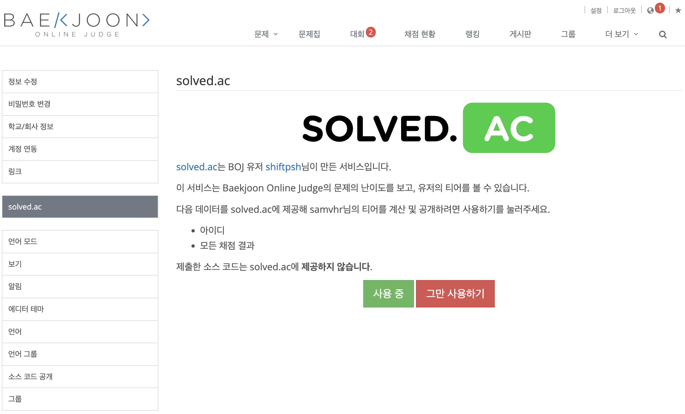
우선 백준 사이트에 회원가입을 해주고 '설정'에서 SOLVED.AC 를 이용하여 본인의 티어와 클래스를 확인하여 동기부여가 되도록 해봅시다.<br/><br/>
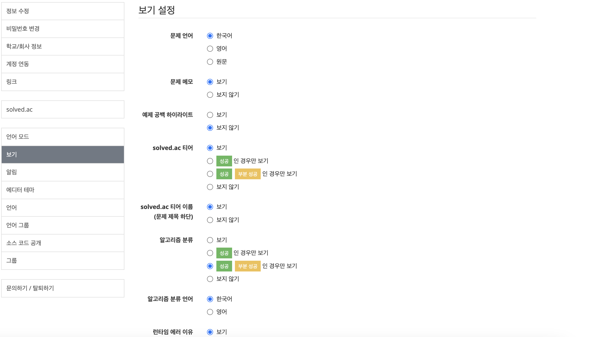
이렇게 되면 기본적인 코딩테스트 공부 준비가 되었다고 봅니다. 이제 문제를 본격적으로 풀어봅시다. 
<br/><br/>

___
# **입출력과 사칙연산**
___
## **2257번 Hello World**
___
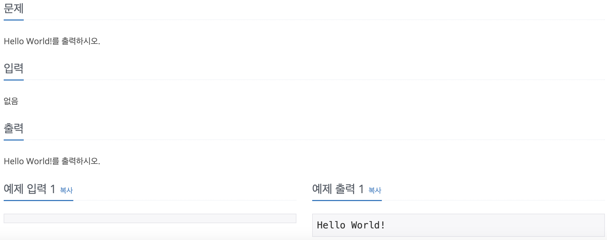
누구나 코딩 공부를 처음 시작한다면 무조건 접하는 Hello World입니다. 오랜만에 보니 참 반가웠습니다.<br/>
망설임 없이 바로 코드를 적었습니다.

```java
package 입출력과사칙연산;

public class Main {

	public static void main(String[] args) {
		System.out.println("Hello World!");
	}

}
```
그러나 결과는<br/>
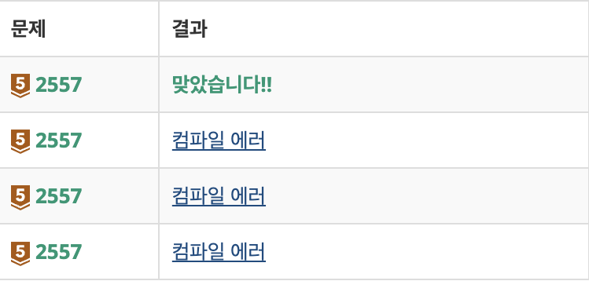
<br/>
예상치 못한 오류 때문에 찾아본 결과<br/>
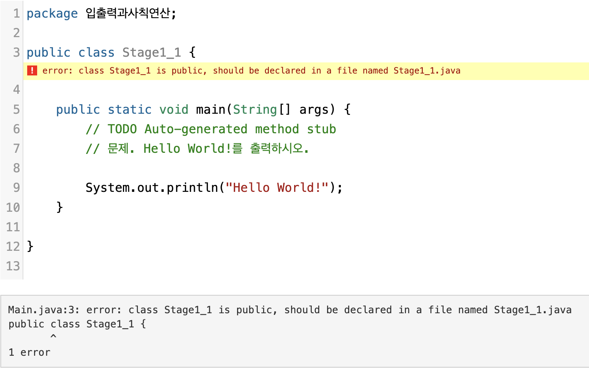
위와 같은 오류 메세지와 추가로 구글링한 결과 백준에서 Java 언어로 답안 코드를 제출할 경우 pacakge 부분은 기입하지 않아도 되고, class 명을 Main 으로 지정해줘야 한다는 것을 알았습니다.<br/>
그렇다면 이를 토대로 다시 코드를 작성해 보면

```java
public class Main {

	public static void main(String[] args) {
		System.out.println("Hello World!");
	}

}
```
이렇게 되고 다시 이 코드를 답안으로 제출하여 정답 처리가 되었습니다.<br/>
Java 언어를 이용하여 백준 사이트 답안을 작성하실때 이점을 유의해 주시기 바랍니다.
<br/><br/>

## **1000번 A+B**
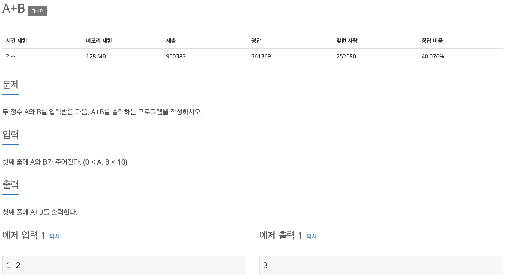
```java
import java.util.Scanner;

public class Main {

	public static void main(String[] args) {
		Scanner scanner = new Scanner(System.in);
		int a = scanner.nextInt();
		int b = scanner.nextInt();
		System.out.println(a + b);
	}

}
```
대부분의 문제에서 공통적인 유형은 입력값과 출력값을 받아오는 것에 대해 설명하고 있습니다. 이러한 것을 충족시키는 코드가 바로 Java 에서는 Scanner 입니다. Scanner 를 사용하기 위해서는 꼭 import를 해줘야 한다는 것을 알고 있어야 합니다.
<br/><br />

## **1001번 A-B**
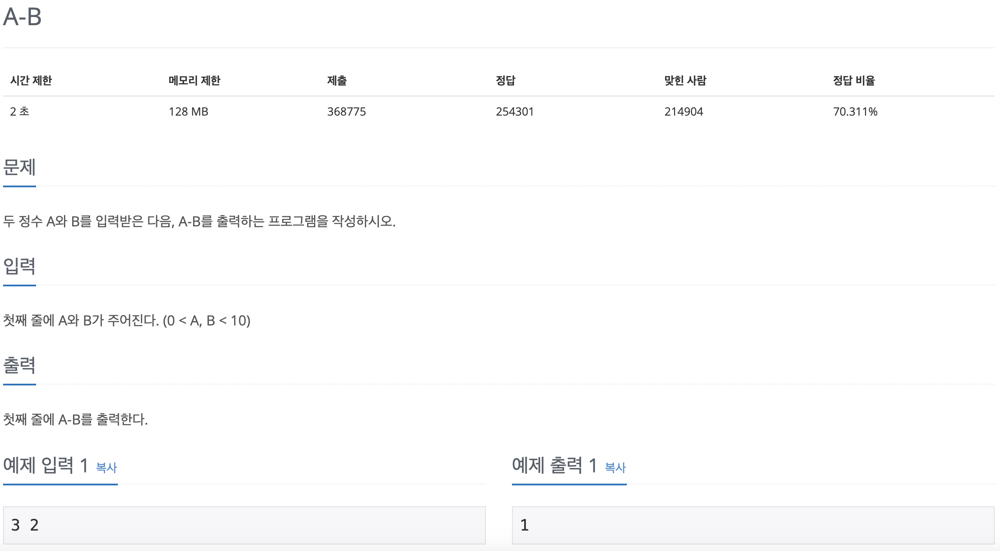
```java
import java.util.Scanner;

public class Main {

	public static void main(String[] args) {
		Scanner scanner = new Scanner(System.in);
		int a = scanner.nextInt();
		int b = scanner.nextInt();
		System.out.println(a - b);
	}

}

```
<br/><br />

## **10998번 AXB**
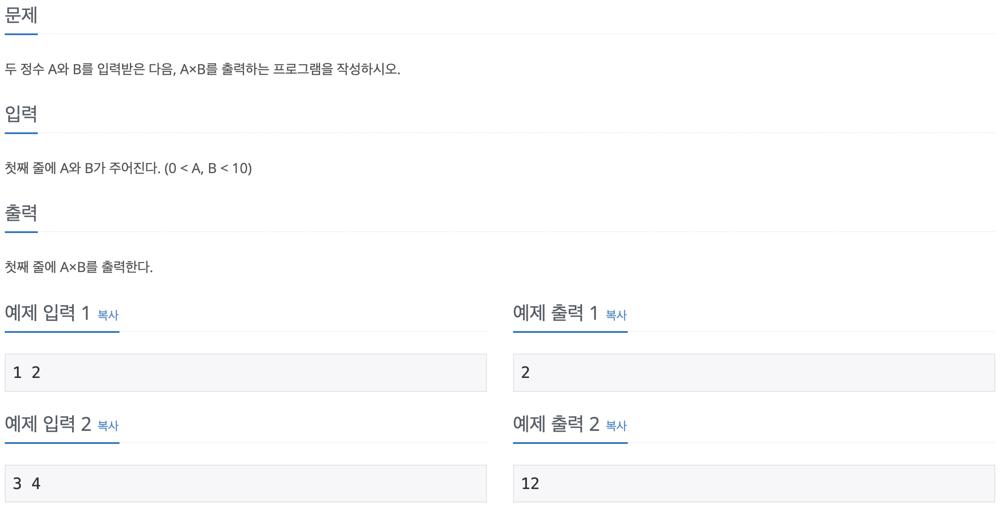
```java
import java.util.Scanner;

public class Main {

	public static void main(String[] args) {
		Scanner scanner = new Scanner(System.in);
		int a = scanner.nextInt();
		int b = scanner.nextInt();
		System.out.println(a * b);
	}

}
```
<br/><br />

## **1008번 A/B**
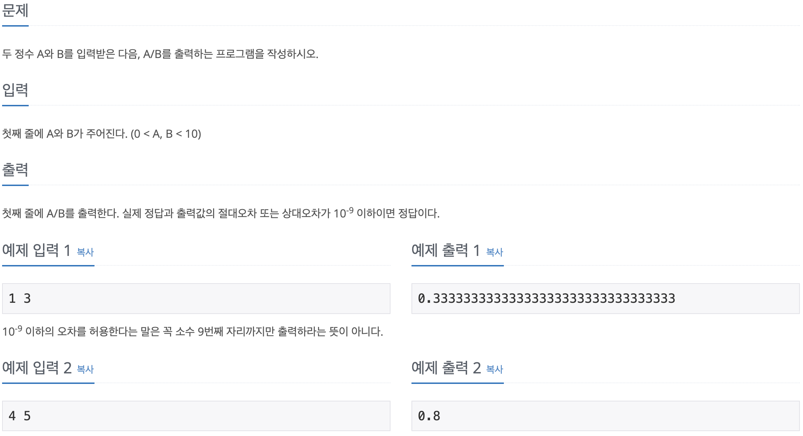
```java
import java.util.Scanner;

public class Main {

	public static void main(String[] args) {
		Scanner scanner = new Scanner(System.in);
		
		double a = scanner.nextDouble();
		
		double b = scanner.nextDouble();
		
		System.out.println(a / b);
		// 실수 float은 오차없이 7자리, double은 15자리! 출력조건에서 출력값의 절대오차 또는 상대오차가 10(-9) 이기 때문에 double 사용.
	}

}
```
위 문제에서 '절대오차 또는 상대오차'에 대한 부분에 유의해야 하는데, Java의 데이터 타입의 종류와 데이터 타입의 자료형에 대한 범위에 대한 부분을 고려해야 합니다.
|분류|종류|설명|
|---|---|---|
|논리형|Boolean|true 와 false 중 하나를 값으로 가지며, 조건식과 논리식에 사용|
|문자형|char|문자를 저장하는데 사용되며, 변수에 하나의 문자만 저장이 가능
|정수형|short, byte, int, long|정수를 저장하는데 사용되며 byte는 이진 데이터, short는 C언어와의 호환을 위해서 추가 되었음|
|실수형|float, double|실수를 저장하는데 사용|

이렇게 Java 는 데이터 타입으로 분류되어 있고, 문제에 해당되는 타입을 설정하려면 실수형 데이터 타입으로 해주어야 하는 것을 알 수 있습니다.<br />
그러나 여기서 한번 더 유의해야 할점은 10^-9 이하의 절대오차 또는 상대오차라는 점입니다. 이는 실수 자료형의 범위에 대해 알아야 합니다.

|자료형|저장 가능한 값의 범위|정밀도|크기|
|---|---|---|---|
|float|1.4E-45 ~ 3.4E38|7자리|32bit = 4byte|
|double|4.9E-324 ~ 1.8E308|15자리|64bit = 8byte|

여기서 정밀도란 10진수로 표현했을 때, 해당 자리 수 까지 표현이 가능하다는 말이고,
정밀도가 높을수록 오차의 범위가 줄어듭니다.<br/>
문제의 10^-9 이하의 절대오차 또는 상대오차는 즉 9자리 이하로 표현이 가능하다 라는 것으로 해석하여 double 자료형을 선택하는 것이 맞습니다.<br/>
다른 데이터 타입의 자료형의 범위도 보자면,
|자료형|저장 가능한 값의 범위|크기|
|---|---|---|
|Boolean|false, true|8bit = 1byte|
|char|'₩u0000' ~ '₩uffff'|16bit = 2byte|
|byte|-128 ~ 127(-2^7 ~ 2^7 - 1)|8bit = 1byte|
|short|-32,768 ~ 32,767(-2^15 ~ 2^15 - 1)|16bit = 2byte|
|int|-2,147,483,648 ~ 2,147,483,647(-2^31 ~ 2^31 - 1, 약+-20억)|32bit = 4byte|
|long|-9,223,372,036,854,775,808 ~ 9,223,372,036,854,775,808(-2^61 ~ 2^61 - 1)|64bit = 8byte|

이렇게 한번 보면 도움이 될 것 같습니다.
<br/><br />

## **10869번 사칙연산**
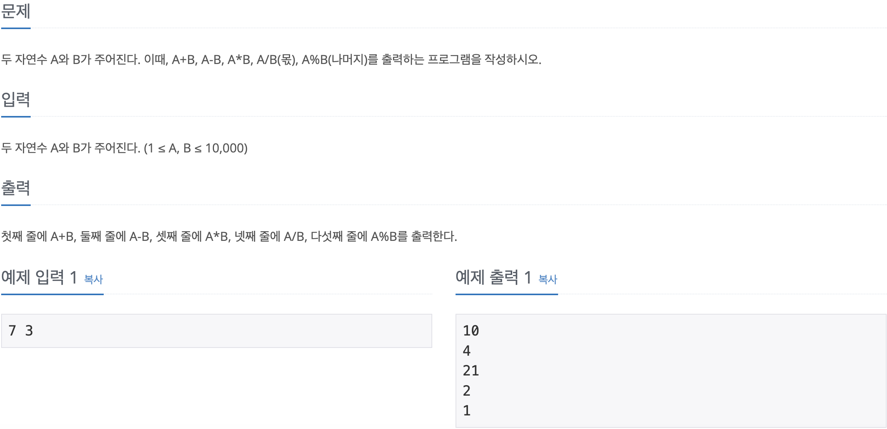
```java
import java.util.Scanner;

public class Main {

	public static void main(String[] args) {
		Scanner scanner = new Scanner(System.in);
		int a = scanner.nextInt();
		int b = scanner.nextInt();
		System.out.println(a + b);
		System.out.println(a - b);
		System.out.println(a * b);
		System.out.println(a / b);
		System.out.println(a % b);
	}

}
```
<br/><br />

## **10926번 ??!**
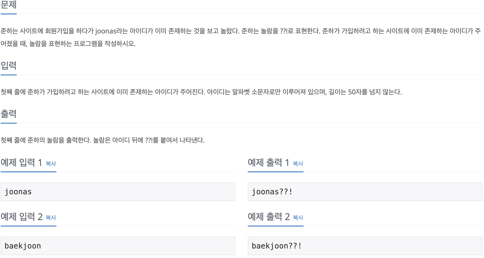
```java
import java.util.Scanner;

public class Main {

	public static void main(String[] args) {
		Scanner scanner = new Scanner(System.in);
		String id = scanner.nextLine();
		System.out.println(id + "??!");
	}

}
```
문자열을 출력받는 Scanner 의 메서드는 nextLine() 입니다
<br/><br />

## **18108번 1998년생인 내가 태국에서는 2541년생?!**
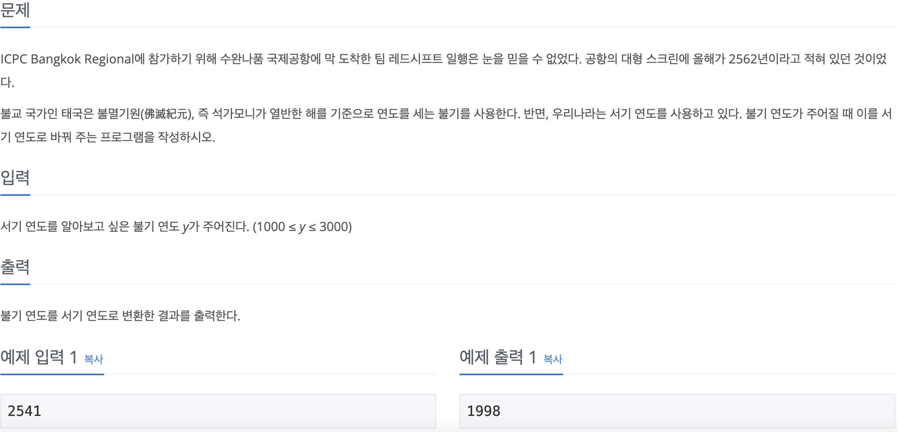
```java
import java.util.Scanner;

public class Main {

	public static void main(String[] args) {
		Scanner scanner = new Scanner(System.in);
		int nowYear = scanner.nextInt();
		System.out.println(nowYear - 543);
	}

}
```
불기를 사용한 연도 식을 구하여 코드를 작성해 주면 됩니다.
<br/><br />

## **10430번 나머지**
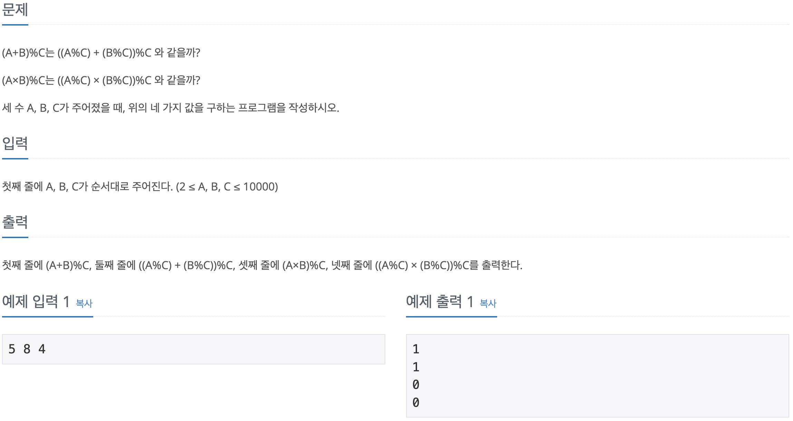
```java
import java.util.Scanner;

public class Main {

	public static void main(String[] args) {
		Scanner scanner = new Scanner(System.in);
		int a = scanner.nextInt();
		int b = scanner.nextInt();
		int c = scanner.nextInt();
		System.out.println((a + b) % c);
		System.out.println(((a % c) + (b % c)) % c);
		System.out.println((a * b) % c);
		System.out.println(((a % c) * (b % c)) % c);
	}

}
```
<br/><br />

## **2588번 곱셈**
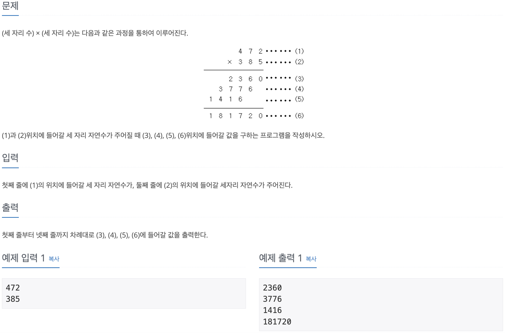
```java
import java.util.Scanner;

public class Main {

	public static void main(String[] args) {
		Scanner scanner = new Scanner(System.in);
		int a = scanner.nextInt();
		int b = scanner.nextInt();
		System.out.println(a * ((b % 100) % 10));
		System.out.println(a * ((b % 100) / 10));
		System.out.println(a * (b / 100));
		System.out.println(a * b);
	}

}
```
<br/><br />

## **11382번 꼬마 정민**
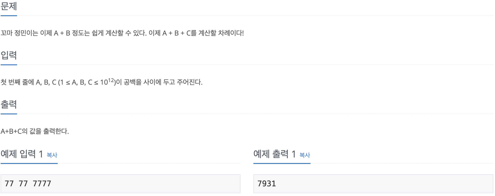
```java
import java.util.Scanner;

public class Main {

	public static void main(String[] args) {
		Scanner scanner = new Scanner(System.in);
		long a = scanner.nextLong();
		long b = scanner.nextLong();
		long c = scanner.nextLong();
		System.out.println(a + b + c);

	}

}
```
앞의 1008번 문제와 같이 10^12 라는 표현에 유의하여 해당되는 데이터 타입 자료형의 메서드를 작성하면 됩니다.
<br/><br />

## **10171번 고양이**
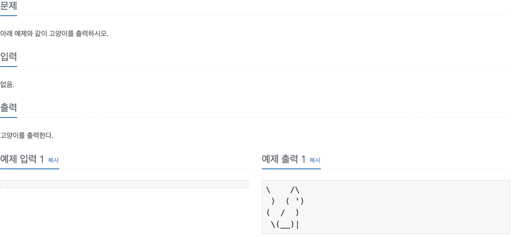
```java
public class Main {

	public static void main(String[] args) {
		System.out.println("\\    /\\");
		System.out.println(" )  ( ')");
		System.out.println("(  /  )");
		System.out.println(" \\(__)|");
	}

}
```
<br/><br />

## **10172번 개**
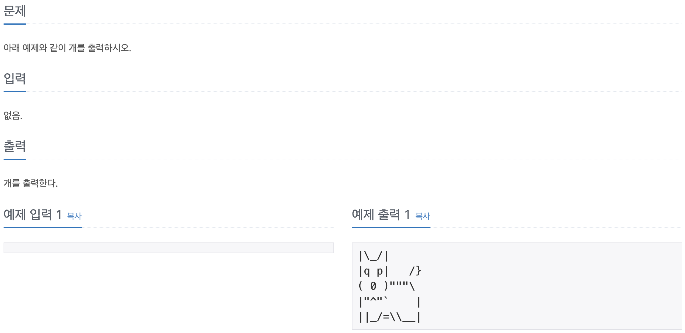
```java
public class Main {

	public static void main(String[] args) {
		System.out.println("|\\_/|");
		System.out.println("|q p|   /}");
		System.out.println("( 0 )\"\"\"\\");
		System.out.println("|\"^\"`    |");
		System.out.println("||_/=\\\\__|");
	}

}
```